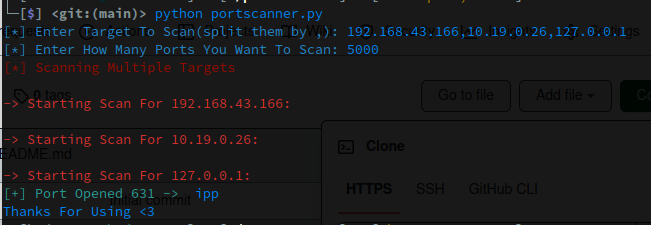

# port-scanner
Using this program, you can specify the opened ports of a desired IP.
# Requirments :
run `pip install termcolor` in your terminal or cmd.
# How to work:
run `python portscanner.py` in your cmd or terminal 
then enter the ips you want to scan splited with `,` then enter number of port and again press enter at the end see the results :D.

