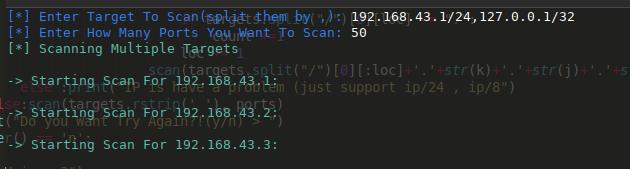

# port-scanner
Using this program, you can specify the opened ports of a desired IP.
# Requirments :
run `pip install termcolor` in your terminal or cmd .
### Download and Use

```bash
  # Download
  $ git clone https://github.com/RezaChabok/port-scanner && cd port-scanner
    
  # Install libs and dependencies
  $ pip install termcolor
  
  # Use
  $ python port-scanner.py
```


 
then enter the ips you want to scan splited with `,` then enter number of port and again press enter at the end see the results :D.



